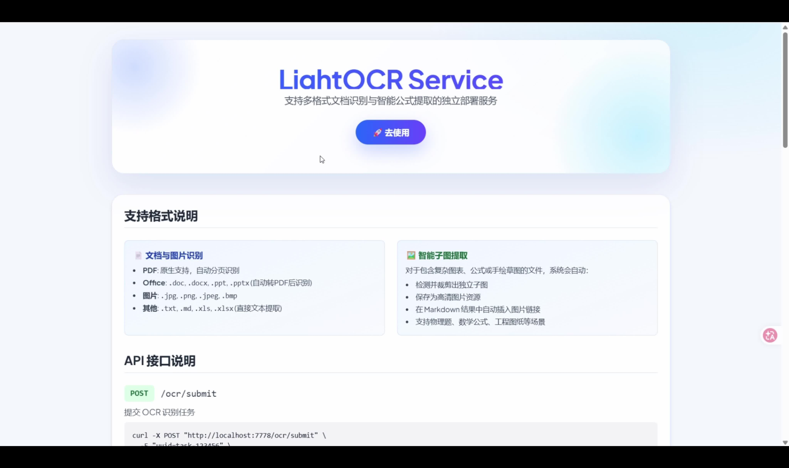

# LightOCR Service

LightOCR Service 是一个基于 FastAPI 的 OCR 服务，支持常见文档与图片识别，并提供简洁的 Web 页面用于在线测试。

## 功能概览

- 支持格式：`pdf`、`doc/docx`、`ppt/pptx`、`jpg/jpeg/png`、`txt/md`、`xls/xlsx`
- 输出结果：统一返回 Markdown 文本（含图片引用）
- 部署方式：本地直接运行 / Docker 运行

## 演示视频

[](./app/static/demo.mp4)

> 点击上方封面图即可打开 `demo.mp4`

## 识别模式

- `rapiddoc`（默认）
  - 本地模型解析，开箱即用，适合作为默认生产模式
- `vlm_opencv`（备选）
  - 基于视觉大模型 + 图像处理，适合更复杂版面
  - 需要配置外部 OCR 服务相关环境变量

## 环境变量（.env）

可参考 `.env.example`：

- `SERVICE_BASE_URL`：服务对外访问地址（用于拼接返回内容中的资源链接）
  - 例如：`http://目标ip:目标端口`
- `CLEANUP_RETENTION_DAYS`：输出文件保留天数（默认 `3`）
- `OCR_SERVICE_URL` / `OCR_API_KEY` / `OCR_MODEL_NAME`：仅在使用 `vlm_opencv` 时需要
- `OCR_CPU_LIMIT_PERCENT`：限制进程可用 CPU 比例（如 `60`）
- `OCR_MAX_CONCURRENT_TASKS`：限制同时 OCR 任务数（默认 `2`）
- `OCR_MAX_THREADS`：限制 OpenCV/数值库线程数（如 `2`）
- `OCR_MAX_WORKERS`：`vlm_opencv` 模式下每个 PDF 的页并发（如 `10`）

说明：

- 不配置 `OCR_SERVICE_URL`、`OCR_API_KEY`、`OCR_MODEL_NAME` 也可以运行。
- 默认 `rapiddoc` 模式可直接工作。
- 笔记本或开发机建议打开 CPU 限制参数，避免 OCR 时占满机器。

## 快速开始

### 方式一：本地直接运行

1. 安装依赖

```bash
pip install -r requirements.txt
```

2. 创建环境变量文件（可选，建议）

```bash
# Linux / macOS
cp .env.example .env

# Windows PowerShell
Copy-Item .env.example .env
```

3. 启动服务

```bash
python app/main.py
```

4. 打开页面

- 首页：`http://127.0.0.1:7778/`
- 在线工具：`http://127.0.0.1:7778/tool`

### 方式二：Docker 运行

1. 构建镜像

```bash
docker build -t lightocr-service:latest .
```

2. 启动容器

```bash
docker run -d -p 7778:7778 \
  --name lightocr \
  -e SERVICE_BASE_URL="http://目标ip:目标端口" \
  -v $(pwd)/output:/app/output \
  lightocr-service:latest
```

启动后访问：

- `http://127.0.0.1:7778/`
- `http://127.0.0.1:7778/tool`

## API（简要）

- `POST /ocr/submit`：提交识别任务
- `GET /ocr/status/{task_id}`：查询任务状态
- `GET /ocr/result/{task_id}`：获取识别结果

如需完整调用示例，可直接在 `/` 页面查看在线文档与示例。

## 开源说明

为避免泄露敏感信息与冗余数据，仓库默认不提交以下内容：

- `.env`（手动配置）
- `app/models/`（服务运行自动下载）
- `output/`（服务运行自动创建）

请在部署环境中自行提供对应配置和模型文件。
